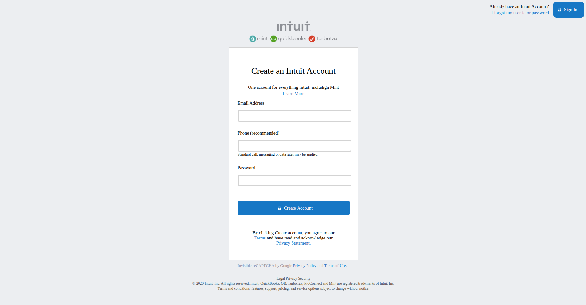

# HTML Forms

> In this project, we built a clone of the mint sign up page. We had to create a form with the correct input type and a submit button.

The project is a Sign up of the Mint Webpage, we created a form with various types of inputs (phone, email, password) and a button with a type of submit.

## Built With

- HTML5
- CSS3

## Authors

👤 **Author1**

- Github: [@yahir91](https://github.com/yahir91)
- Twitter: [@YahirCardona3](https://twitter.com/YahirCardona3)
- Linkedin: [linkedin](https://www.linkedin.com/in/osmar-yahir-cardona-reyes-54b40b1a7/)

👤 **Author2**

- Github: [@e71az](https://github.com/e71az)
- Twitter: [@e71az](https://twitter.com/e71az)
- Linkedin: [linkedin](https://www.linkedin.com/in/elias-casta%C3%B1eda-17a771115/)

## 🤝 Contributing

Contributions, issues and feature requests are welcome!

Feel free to check the [issues page](https://github.com/e71az/HTML-Forms/issues).

## Show your support

Give a ⭐️ if you like this project!

## 📝 License

This project is [MIT](lic.url) licensed.
